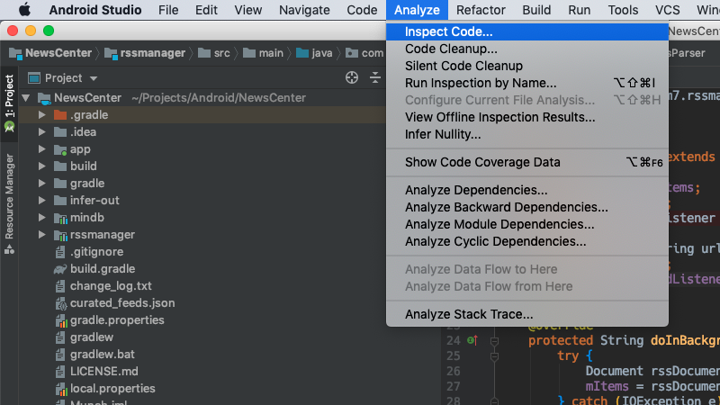
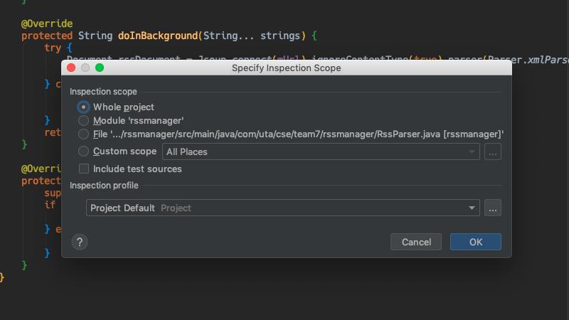
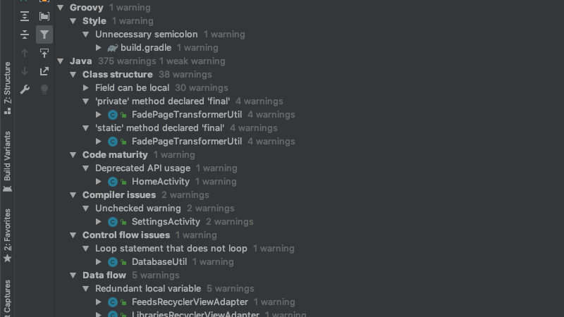

# CSE 5324 - Software Engineering I

Homework 1: Static Analysis

- Name: Bo Lin
- ID: 1001778270
- Team: 7

## Content

- [CSE 5324 - Software Engineering I](#cse-5324---software-engineering-i)
  - [Content](#content)
  - [Project Info](#project-info)
  - [Usage](#usage)
  - [Inspection Result](#inspection-result)
    - [Warning 1](#warning-1)
    - [Warning 2](#warning-2)
    - [Warning 3](#warning-3)
    - [Warning 4](#warning-4)

## Project Info

|                      |                              |
| :------------------: | :--------------------------: |
|       Project        |         News Center          |
|         IDE          |        Android Studio        |
| Programming Language |             Java             |
| Static Analysis Tool | Android Studio build-in tool |

## Usage

- Click the "Analyze" on the menu bar and then click the "Inspect Code..."



- Select the "Whole project" and then click the "OK"



- The analysis results will show in the output



## Inspection Result

### Warning 1

- **Type**: `Control flow issues`
- **Description**: `Loop statement that does not loop`
  - `'do' statement does not loop`
- **File**: `DatabaseUtil.java`
- **Code** :

```java
if (cursor.moveToFirst()) {
    do {
        feedItem.setItemTitle(cursor.getString(cursor.getColumnIndex(columnNames[0])));
        feedItem.setItemDesc(cursor.getString(cursor.getColumnIndex(columnNames[1])));
        feedItem.setItemLink(cursor.getString(cursor.getColumnIndex(columnNames[2])));
        feedItem.setItemImgUrl(cursor.getString(cursor.getColumnIndex(columnNames[3])));
        feedItem.setItemCategory(cursor.getString(cursor.getColumnIndex(columnNames[4])));
        feedItem.setItemSource(cursor.getString(cursor.getColumnIndex(columnNames[5])));
        feedItem.setItemSourceUrl(cursor.getString(cursor.getColumnIndex(columnNames[6])));
        feedItem.setItemPubDate(cursor.getString(cursor.getColumnIndex(columnNames[7])));
        feedItem.setItemCategoryImgId(Integer.parseInt(cursor.getString(cursor.getColumnIndex(columnNames[8]))));
        feedItem.setItemWebDesc(cursor.getString(cursor.getColumnIndex(columnNames[9])));
        break;
    } while (cursor.moveToNext());
}
```

- **Analysis**
  - Can any code execution reach line L?
    - Yes
  - Is there any way in which also the behavior described in the static analysis tool warning can occur at L?
    - Yes
  - Is there also a way in which line L can be reached in a normal execution of method M?
    - Yes
  - This is a good warning and the 'do' statement does not loop. The function of this code is to get the content of each feed. This code will be executed when the channel is refreshed.

### Warning 2

- **Type**: `Performance`
- **Description**: `String concatenation in loop`
  - `String concatenation '+=' in loop`
- **File**: `ArticleInteractor.java`
- **Code** :

```java
for (Element paragraph : paragraphs) {
    String para = paragraph.text().trim();
    if (!para.isEmpty()) {
        body += para + "\n\n";
    }
}
```

- **Analysis**
  - Can any code execution reach line L?
    - Yes
  - Is there any way in which also the behavior described in the static analysis tool warning can occur at L?
    - Yes
  - Is there also a way in which line L can be reached in a normal execution of method M?
    - Yes
  - This is a good warning. This code will be executed when user reads the news. The function of this code is to concatenate paragraph into an article.

### Warning 3

- **Type**: `Probable bugs`
- **Description**: `Constant conditions & exceptions`
  - `Method invocation 'getInt' may produce 'NullPointerException'`
- **File**: `ArticleActivity.java`
- **Code** :

```java
private FeedItem getFeedItem() {
    Bundle bundle = getIntent().getExtras();
    FeedItem feedItem = new FeedItem();
    feedItem.setItemTitle(bundle.getString("title", ""));
    feedItem.setItemCategory(bundle.getString("category", ""));
    feedItem.setItemDesc(bundle.getString("description", ""));
    feedItem.setItemImgUrl(bundle.getString("img_url", ""));
    feedItem.setItemCategoryImgId(bundle.getInt("image_id", 0));
    feedItem.setItemLink(bundle.getString("link", ""));
    feedItem.setItemPubDate(bundle.getString("pub_date", ""));
    feedItem.setItemSource(bundle.getString("source", ""));
    feedItem.setItemSourceUrl(bundle.getString("source_url", ""));
    feedItem.setItemWebDesc(bundle.getString("article_content", ""));
    feedItem.setItemWebDescSync(bundle.getString("sync_desc", ""));
    return feedItem;
}
```

- **Analysis**
  - Can any code execution reach line L?
    - Yes
  - Is there any way in which also the behavior described in the static analysis tool warning can occur at L?
    - Yes
  - Is there also a way in which line L can be reached in a normal execution of method M?
    - Yes
  - This is a good warning. The function of this code is to get the content of each feed and it may produce 'NPE' when getString function get nothing. This code will be executed when the user clicks on a news item.

### Warning 4

- **Type**: `Probable bugs`
- **Description**: `@NotNull/@Nullable problems`
  - `Not annotated parameter overrides @NonNull parameter`
- **File**: `ArticleActivity.java`
- **Code** :

```java
if (id == R.id.action_delete) {
    MaterialDialog confirmDeleteDialog = new MaterialDialog.Builder(this)
            .title(R.string.delete_this_feed)
            .content(R.string.delete_this_feed_desc)
            .iconRes(R.drawable.ic_delete_24dp)
            .positiveText(R.string.delete)
            .negativeText(R.string.cancel)
            .onPositive(new MaterialDialog.SingleButtonCallback() {
                @Override
                public void onClick(MaterialDialog materialDialog, DialogAction dialogAction) {
                    mFeedsPresenter.deleteSelectedFeed(getFeedItem());
                    Intent intent = new Intent(ArticleActivity.this, HomeActivity.class);
                    startActivity(intent);
                    finish();
                }
            }).build();
    confirmDeleteDialog.show();
    return true;
}
```

- **Analysis**
  - Can any code execution reach line L?
    - Yes
  - Is there any way in which also the behavior described in the static analysis tool warning can occur at L?
    - Yes
  - Is there also a way in which line L can be reached in a normal execution of method M?
    - Yes
  - This is a good warning. This code will be executed when user deletes an RSS channel. The function of this code is to generate a confirmation delete dialog. The parameters of `onClick` function should be annotated as @Nullable or @NotNull.
